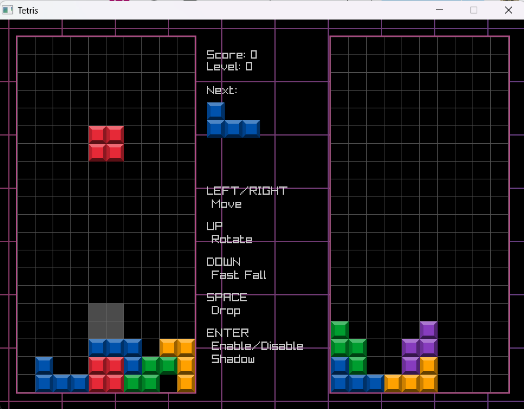
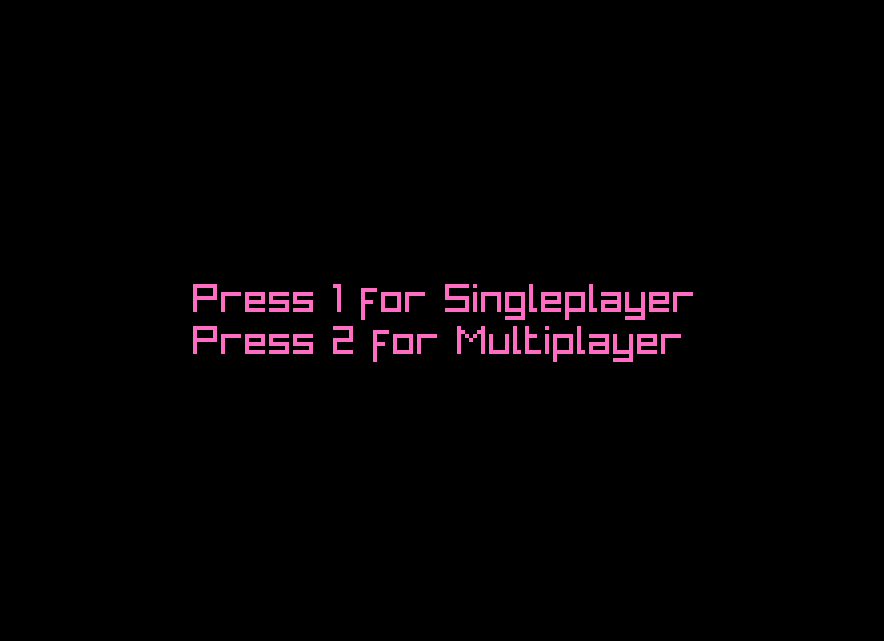
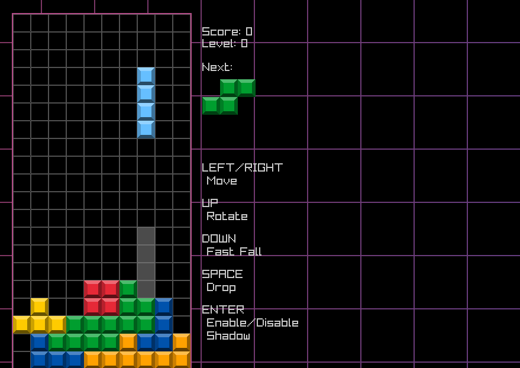
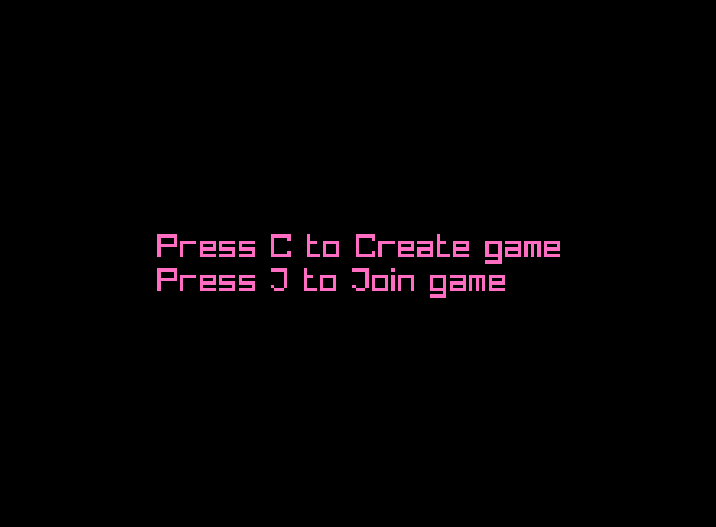
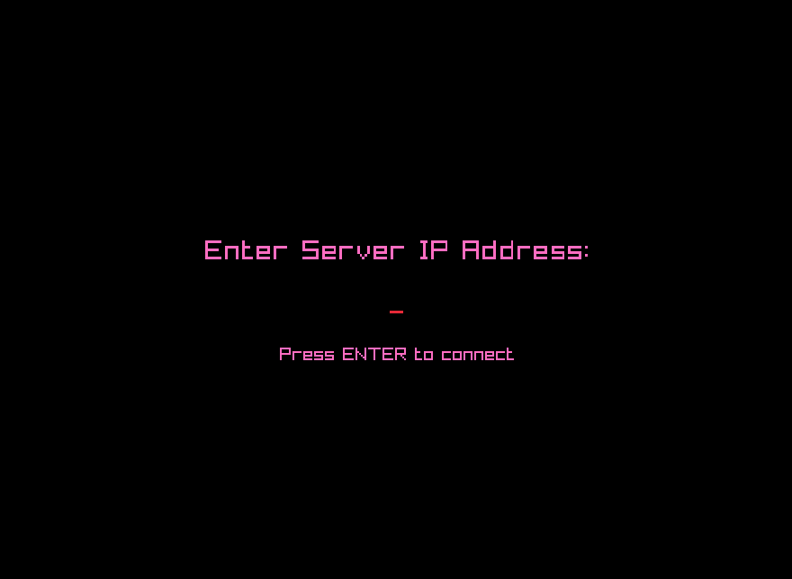

# IN204_Tetris Paul Plays Rayan Ramadan

Projet tetris avec une fonction de multijoueur en ligne pour le cours IN204



## Pré-requis
Vous aurez besoin de:
- Un compilateur C++ (g++/clang++) qui supporte C++17
- La librairie graphique raylib (que vous pouvez installer via : https://github.com/raysan5/raylib.git)
- La librairie réseau enet que vous trouverez ici : https://github.com/zpl-c/enet

## Guide d'installation 
Pour plus d'information sur Enet : http://enet.bespin.org/index.html

Pour plus d'information sur Raylib : https://www.raylib.com/index.html
### Commandes pour l'installation de Enet

```bash
set -e

echo "=== Téléchargement d'ENet depuis GitHub ==="
git clone https://github.com/lsalzman/enet.git
cd enet

echo "=== Création du dossier build et compilation ==="
mkdir -p build
cd build
cmake ..
make

echo "=== Installation d'ENet sur le système ==="
sudo make install
sudo ldconfig
```
### Commandes pour installer Raylib
```bash
set -e

echo "=== Installation des dépendances ==="
sudo apt update
sudo apt install -y libglfw3-dev libopenal-dev libpthread-stubs0-dev libx11-dev libxcursor-dev libxrandr-dev libxi-dev

echo "=== Téléchargement de Raylib depuis GitHub ==="
git clone https://github.com/raysan5/raylib.git
cd raylib

echo "=== Création du dossier build et compilation ==="
mkdir -p build
cd build
cmake ..
make

echo "=== Installation de Raylib sur le système ==="
sudo make install
sudo ldconfig
```

Build:

```bash
make
```

Clean:

```bash
make clean
```
Une fois le fichier `tetris` créé, il suffit de l'éxecuter pour que le jeu se lance.

## Guide d'utilisation 

Le jeu propose deux modes, un mode à 1 joueur et un mode à 2 joueur en ligne.

Pour jouer en solo, il suffit d'appuyer sur la touche 1 du clavier et la partie se lance.




### Mode Multijoueur

Pour jouer en mode multijoueur il faut suivre plusieurs étape :

- Le premier joueur lance le jeu et appuie sur la touche 2 afin d'accéder au mode multijoueur
- Un deuxième menu s'ouvre, il doit alors appuyer sur la touche C, c'est lui qui jouera le rôle du serveur



- Le premier joueur est alors en attente du deuxième


- Le deuxième joueur lance le jeu et appuie sur la touche 2
- Il appuie ensuite sur J pour rejoindre une partie, l'adresse IP du premier joueur lui sera alors demandé



- Une fois l'adresse IP renseigné, le joueur 2 rejoins la partie et la partie se lance

